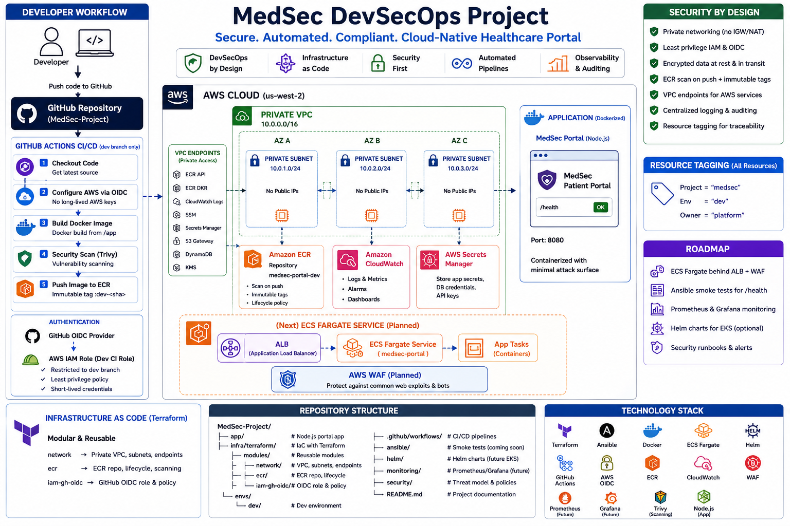

# MedSec DevSecOps Project

# MedSec Project (DevSecOps Healthcare Portal)

## 📌 Overview

MedSec is a **DevSecOps reference project** for a healthcare portal.
It demonstrates how to build **secure, cloud-native infrastructure and applications** with:

* **Terraform** (modular IaC)
* **Ansible** (post-deploy checks & automation)
* **Docker** (containerized app)
* **ECS Fargate** (serverless containers)
* **Helm** (future EKS option)
* **GitHub Actions** (CI/CD with OIDC)
* **Security-first practices** (private networking, IAM least privilege, encrypted storage, WAF, monitoring)

---

## 🎯 Goals

* Simplify **patient portal deployments** with automation.
* Ensure **compliance & security** by design (encryption, tagging, auditing).
* Provide a **learning reference** for DevSecOps pipelines.
* Scale from **dev → staging → prod** with reusable modules.

---

## 🏗️ Current Architecture (v0.1 – Dev environment)



* **Private VPC** in `us-west-2` with isolated subnets & VPC endpoints
* **Amazon ECR**: secure repo `medsec-portal-dev`, immutable tags, lifecycle cleanup
* **IAM + GitHub OIDC**: role restricted to the `dev` branch for CI pipelines
* **CI workflow**: builds → scans → pushes images to ECR (`.github/workflows/dev-ci.yml`)

> Next: ECS Fargate service + ALB + WAF, Ansible smoke tests, Prometheus monitoring.

---

## 📂 Repository Structure

```
MedSec-Project/
├── app/                  # Minimal Node.js portal app
├── infra/
│   └── terraform/
│       ├── modules/      # Reusable Terraform modules
│       │   ├── network/      # Private VPC, subnets, endpoints
│       │   ├── ecr/          # ECR repo, lifecycle
│       │   └── iam-gh-oidc/  # GitHub OIDC role + policy
│       └── envs/
│           └── dev/          # Dev environment wiring modules
├── .github/workflows/    # CI/CD pipelines (dev-ci.yml)
├── ansible/              # Smoke test playbooks (coming soon)
├── helm/                 # Helm charts (future EKS support)
├── monitoring/           # Prometheus/Grafana configs (future)
├── security/             # Threat model & policies
└── README.md
```

---

## ⚙️ Developer Setup

### 1. Provision Infrastructure

```bash
cd infra/terraform/envs/dev
terraform init
terraform apply -auto-approve
```

Outputs will include:

* `vpc_id`
* `private_subnet_ids`
* `ecr_repo_url`
* `ci_role_arn`

### 2. Configure GitHub

* Add a repo secret:

  * `CI_ROLE_ARN` → paste the Terraform output `ci_role_arn`.

### 3. CI/CD Workflow

Pushing to the **`dev` branch** triggers `.github/workflows/dev-ci.yml`:

* Authenticates via OIDC (no long-lived AWS keys)
* Builds Docker image from `/app`
* Runs Trivy scan (to be added)
* Pushes image to ECR as `:dev-<sha>`

### 4. Test Locally (optional)

```bash
cd app
docker build -t medsec-portal:dev .
docker run --rm -p 8080:8080 medsec-portal:dev
curl http://localhost:8080/health
```

---

## 🔐 Tags & Security Conventions

All AWS resources are tagged for traceability:

```
Project = "medsec"
Env     = "dev"
Owner   = "platform"
```

Security by design:

* Private subnets only (no IGW/NAT)
* VPC endpoints for ECR, Logs, SSM, Secrets Manager, etc.
* IAM roles scoped to branch & repo
* ECR with scan-on-push + immutable tags

---

## 🛠️ Roadmap

* [ ] ECS Fargate service behind ALB + WAF
* [ ] Ansible smoke tests for `/health` endpoint
* [ ] Prometheus/Grafana for observability
* [ ] Helm charts for optional EKS deployments
* [ ] Security runbooks and monitoring alerts

---

## 📜 License

MIT (or your organization’s preferred license)

---

